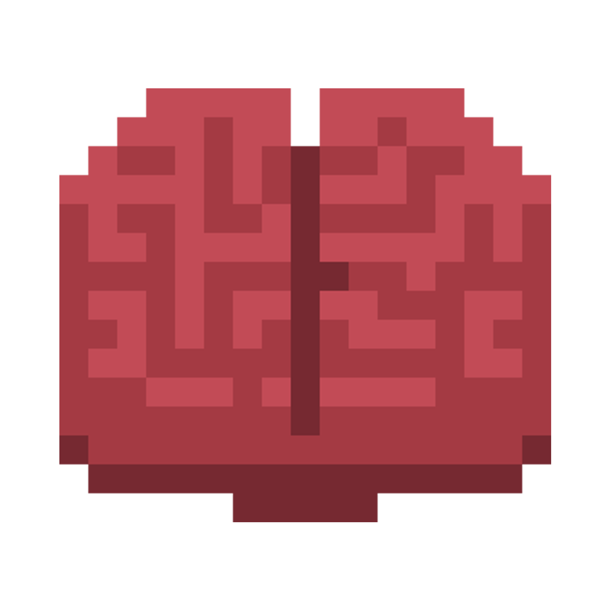

|  | **Power-For-Jarred-Brain** |
|------------------------------------------------------|--------------------------|

 Game for the Bigmode Game Jam 2025

-------------------------------
## Game Presentation

Power-For-Jarred-Brain is a short platformer RPG. 
The main mechanic of the game revolves around the
theme of the jam - "power". The player has a limited amount 
of power, which is depleted with every movement.
You will need to move carefully 
and strategically to avoid running out of power.

## Inputs

### MOVE
- **A** - LEFT
- **D** - RIGHT
- **SPACE** - JUMP

### INTERACTIONS
- **E** - interact with NPC / pick items

-------------------------------

## Build:
UNITY EDITOR VERSION: 2022.3.40f1 

The game demo can be played in browser here: https://barzoius.itch.io/power-for-jarred-brain 

